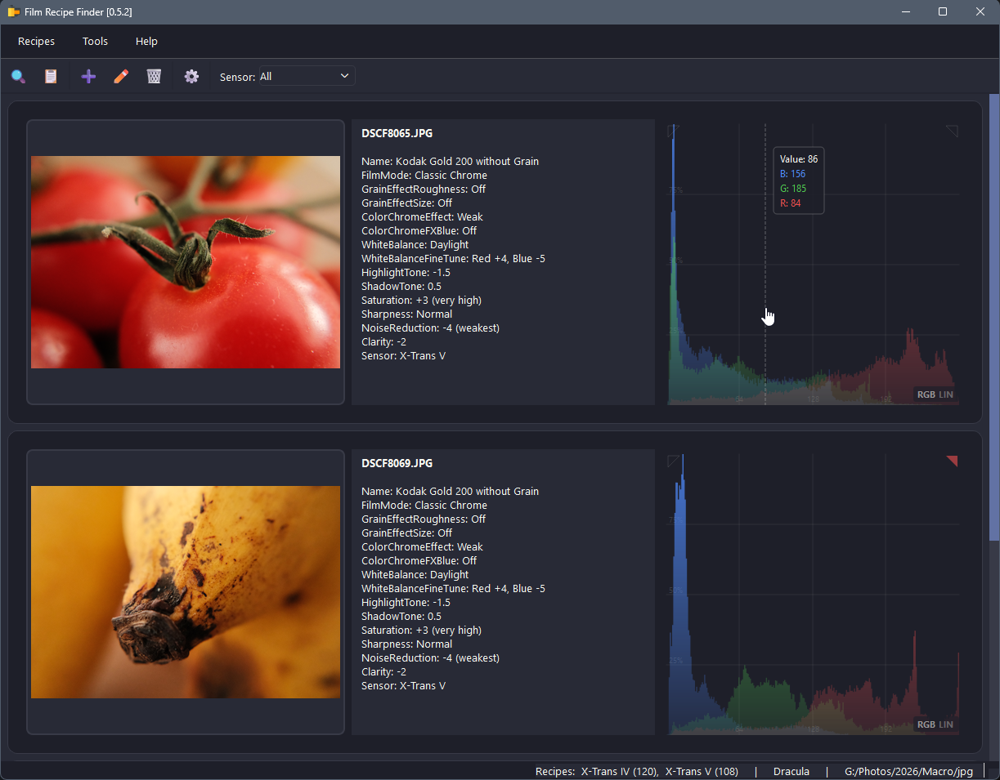
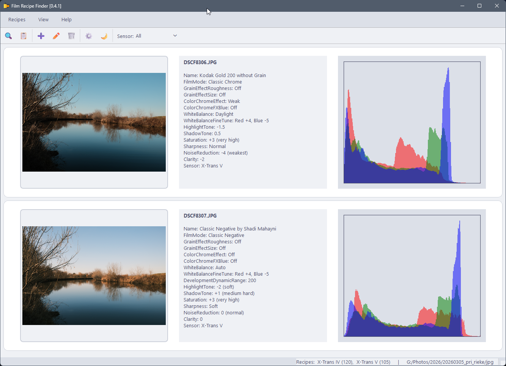
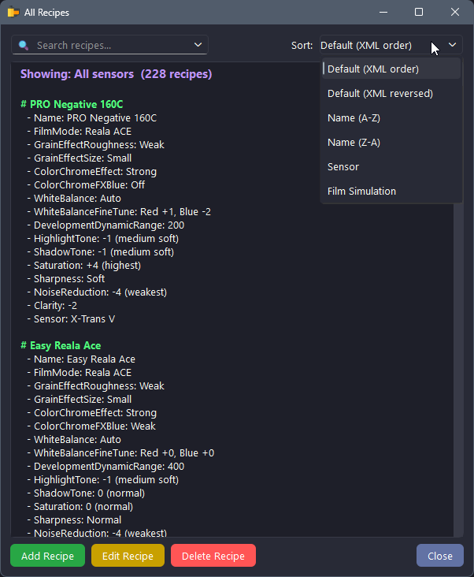
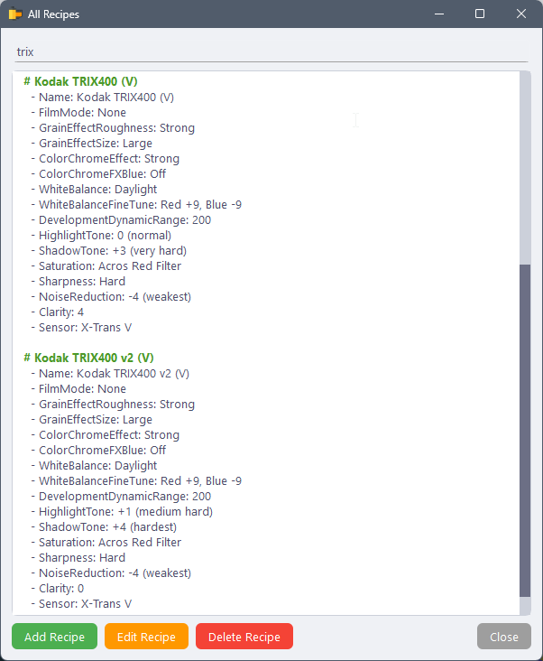
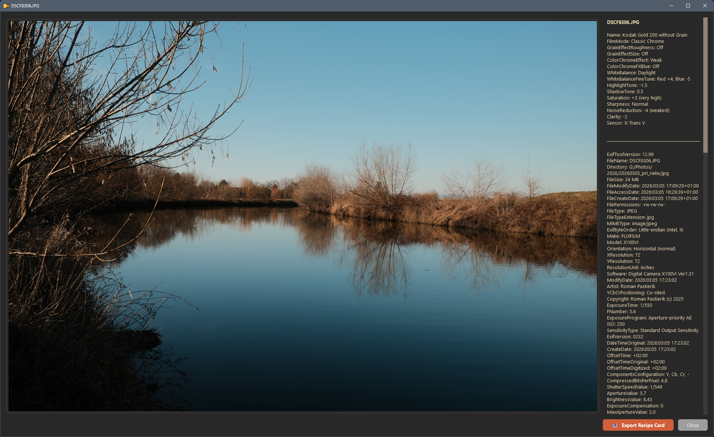
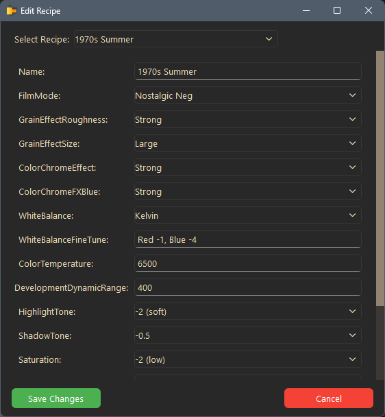
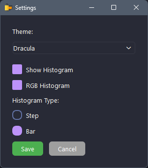

# Film Recipe Finder

A desktop application for identifying and managing Fujifilm film simulation recipes from JPEG/RAW photos using EXIF metadata.

> ⚠️ **Platform support:** Currently Windows only. Linux support coming soon.


---

## Features

- **Identify film simulation recipes** from Fujifilm JPEG photos by reading EXIF data
- **Drag & Drop** support – simply drag photos into the application window
- **Recipe browser** – browse, search, add, edit and delete recipes
- **Histogram** – RGB or luminance histogram for each photo (optional)
- **Full EXIF viewer** – view short or full EXIF data for any photo
- **Detail view** – click on any image card to open a full-size detail with complete EXIF
- **Dark / Light theme** – Gruvbox-inspired dark theme and clean light theme
- **Persistent settings** – remembers last directory, theme, and histogram preferences

---
## Screenshots

### Dark Theme


### Light Theme  


### Recipe Browser - Dark Theme


### Recipe Browser - Light Theme


### Detail View with Full Exif


### Add new recipe


### Edit recipe


### Settings


---

## Requirements

- Python 3.10 or newer
- [ExifTool](https://exiftool.org/) by Phil Harvey (must be in system PATH or placed in app directory)

### Python packages

```
PyQt6
Pillow
numpy
matplotlib
```

Install with:

```bash
pip install PyQt6 Pillow numpy matplotlib
```

---

## Getting Started

1. Clone the repository:

```bash
git clone https://github.com/rpastierik/FilmRecipeFinder.git
cd FilmRecipeFinder
```

2. Install dependencies:

```bash
pip install PyQt6 Pillow numpy matplotlib
```

3. Make sure **ExifTool** is available:
   - On Windows: place `exiftool.exe` in the app directory or add it to system PATH
   - On Linux/macOS: install via package manager (`brew install exiftool` or `sudo apt install libimage-exiftool-perl`)

4. Run the application:

```bash
python film_recipe_finder.py
```

---

## File Structure

```
FilmRecipeFinder/
├── screeshots/            # Application screeshots
├
├── film_recipe_finder.py  # Main application
├── themes.py              # Dark and light QSS themes
├── film_simulations.xml   # Recipe database
├── user_settings.json     # User preferences (auto-generated)
├── icon.png
└── README.md
```

---

## Usage

### Identify a Recipe
- Go to **Recipes → Identify Recipe** or drag & drop photos directly into the window
- The app compares EXIF data against the recipe database and displays the matching recipe

### Browse Recipes
- Go to **Recipes → Show All Recipes**
- Use the search box to filter by name or any recipe parameter

### Add / Edit / Delete Recipes
- Use the **Recipes** menu or the buttons in the Recipe Browser window
- Recipes can also be loaded directly from a photo using **From Picture**

### Settings
- Go to **View → Settings** to toggle histogram display, switch between RGB/luminance, and change histogram type
- Go to **View → Switch to Light/Dark Mode** to change the theme

---

## Recipe Database

Recipes are stored in `film_simulations.xml`. Each recipe contains:

| Field | Description |
|---|---|
| Name | Recipe name |
| FilmMode | Fujifilm film simulation mode |
| GrainEffectRoughness | Grain roughness (Off / Weak / Strong) |
| GrainEffectSize | Grain size (Off / Small / Large) |
| ColorChromeEffect | Color Chrome effect |
| ColorChromeFXBlue | Color Chrome FX Blue |
| WhiteBalance | White balance setting |
| HighlightTone | Highlight tone adjustment |
| ShadowTone | Shadow tone adjustment |
| Saturation | Saturation |
| Sharpness | Sharpness setting |
| NoiseReduction | Noise reduction level |
| Clarity | Clarity adjustment |
| Sensor | X-Trans generation (I–V) |

---

## License

This project is licensed under the **GNU General Public License v3**.
See [LICENSE](LICENSE) for details.

---

## Credits

- **ExifTool** by Phil Harvey (philharvey66@gmail.com) – [exiftool.org](https://exiftool.org/)
- Themes inspired by [Gruvbox](https://github.com/morhetz/gruvbox) and [Catppuccin](https://github.com/catppuccin/catppuccin)

---

## Support

If you find this tool useful, consider supporting development:

[](https://ko-fi.com/rpastierik)