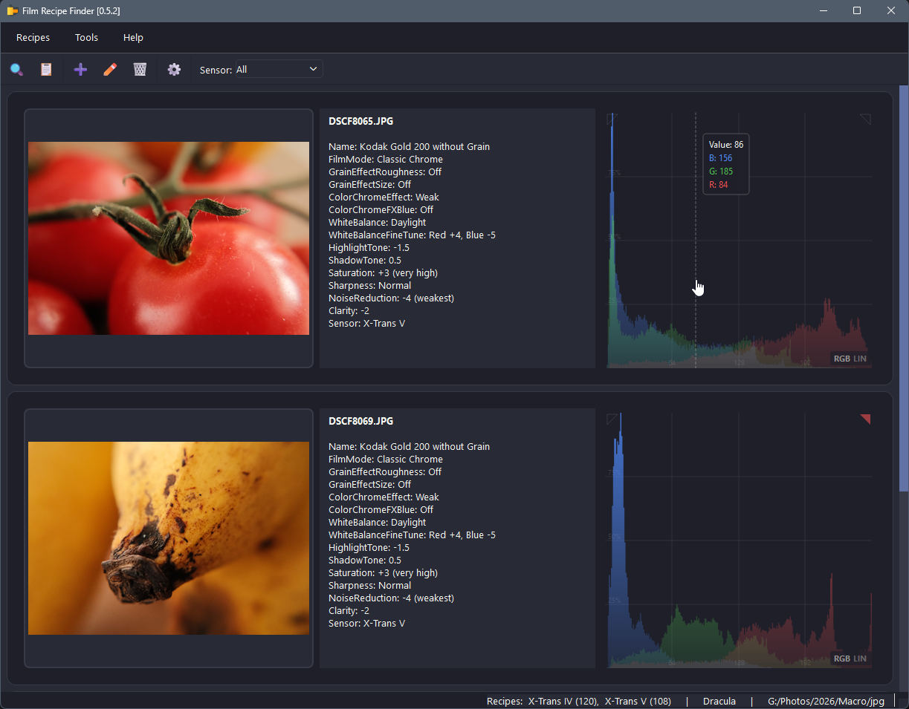
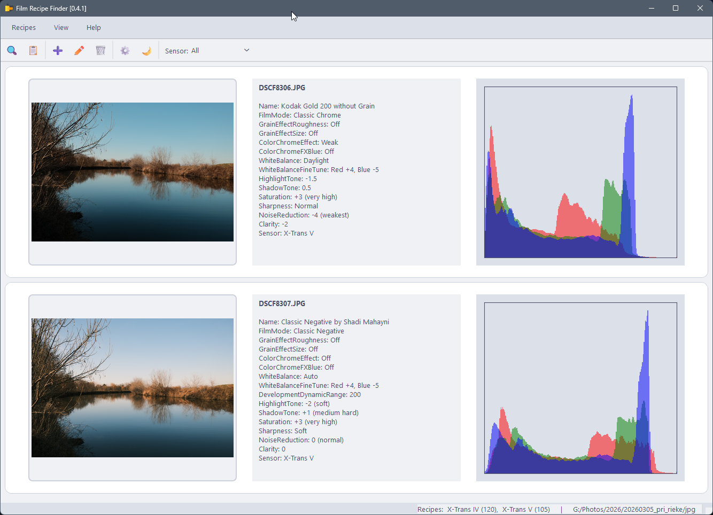
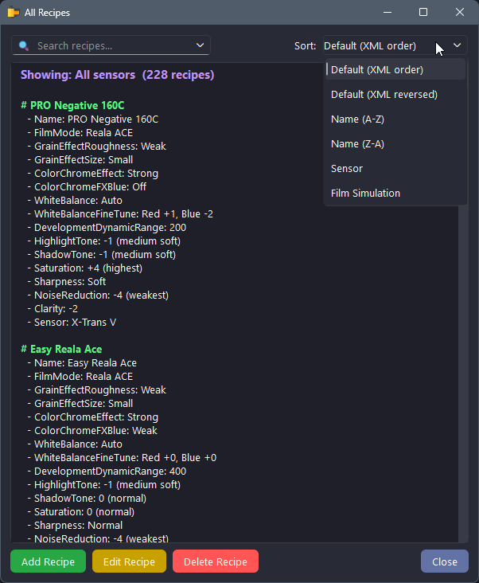
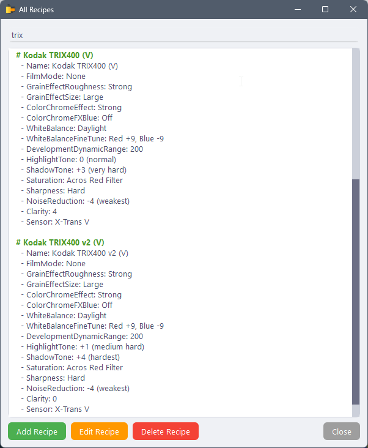
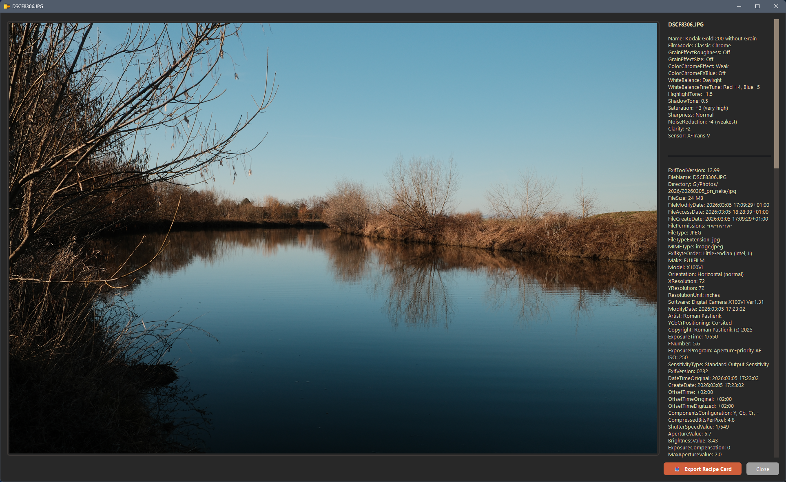
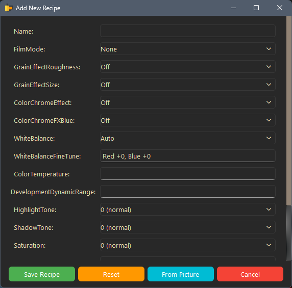
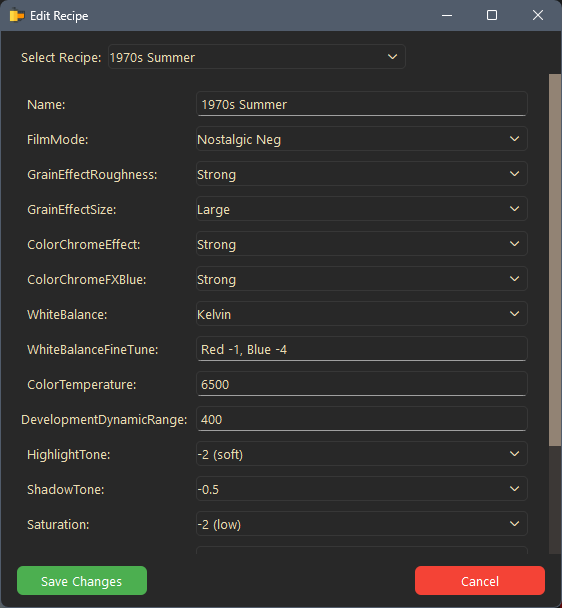
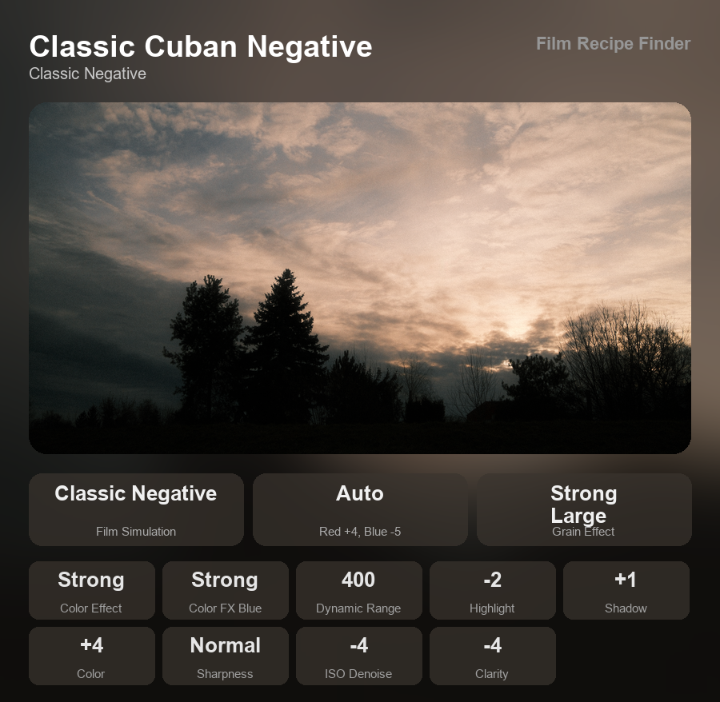
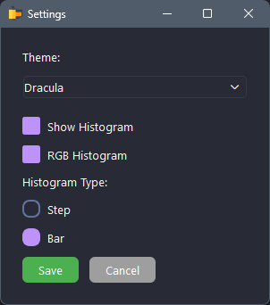

# Film Recipe Finder

A desktop application for identifying and managing Fujifilm film simulation recipes from JPEG photos using EXIF metadata.


---

## Features

- **Identify film simulation recipes** from Fujifilm JPEG photos by reading EXIF data
- **Drag & Drop** support – simply drag photos into the application window
- **Recipe browser** – browse, search, add, edit and delete recipes
- **Sensor filter** – filter recipes by X-Trans generation (I–V) via toolbar or Settings
- **Histogram** – RGB or luminance histogram for each photo (optional)
- **Full EXIF viewer** – view full EXIF data for any photo
- **Detail view** – click on any image card to open a full-size detail with complete EXIF
- **Export Recipe Card** – export a stylized recipe card as PNG from any photo
- **Import from Text** – paste recipe text from Fuji X Weekly or similar sources and auto-fill all fields
- **Dark / Light theme** – Gruvbox-inspired dark theme and Catppuccin Latte light theme
- **Persistent settings** – remembers last directory, theme, histogram preferences and active sensor filter

---

## Screenshots

### Dark Theme


### Light Theme


### Recipe Browser - Dark Theme


### Recipe Browser - Light Theme


### Detail View with Full Exif


### Add New Recipe


### Edit Recipe


### Export Recipe Card


### Settings


---

## Requirements

- Python 3.10 or newer
- [ExifTool](https://exiftool.org/) by Phil Harvey (must be in system PATH or placed in app directory)

### Python packages

```
PyQt6
Pillow
numpy
matplotlib
```

Install with:

```bash
pip install PyQt6 Pillow numpy matplotlib
```

---

## Getting Started

1. Clone the repository:

```bash
git clone https://github.com/rpastierik/FilmRecipeFinder.git
cd FilmRecipeFinder
```

2. Install dependencies:

```bash
pip install PyQt6 Pillow numpy matplotlib
```

3. Make sure **ExifTool** is available:
   - On Windows: place `exiftool.exe` in the app directory or add it to system PATH
   - On Linux/macOS: install via package manager (`brew install exiftool` or `sudo apt install libimage-exiftool-perl`)

4. Run the application:

```bash
python film_recipe_finder.py
```

---

## Running on macOS

1. Clone the repository and install dependencies as described in [Getting Started](#getting-started)

2. Install ExifTool via Homebrew:
```bash
brew install exiftool
```
If you don't have Homebrew installed, get it first at [brew.sh](https://brew.sh).

3. Run the application:
```bash
python film_recipe_finder.py
```

### Possible issues on macOS

- **`python` vs `python3`** – on newer Macs you may need to use `python3` and `pip3` instead
- **PyQt6 and macOS permissions** – if the window doesn't open, try running with `pythonw` or grant terminal permissions under *System Settings → Privacy & Security*
- **Virtual environment** – recommended to avoid mixing system packages:
```bash
python3 -m venv venv
source venv/bin/activate
pip install PyQt6 Pillow numpy matplotlib
python film_recipe_finder.py
```

---

## File Structure

```
FilmRecipeFinder/
├── screenshots/               # Application screenshots
│
├── film_recipe_finder.py      # Entry point
├── main_window.py             # Main application window
├── constants.py               # Constants and recipe field definitions
├── themes.py                  # Dark and light QSS themes
│
├── utils/                     # Shared utilities
│   ├── __init__.py            # resource_path, parse_wbft
│   └── recipe_text_parser.py  # Recipe text import parser
│
├── managers/                  # Data & business logic
│   ├── settings_manager.py    # Load/save user settings
│   ├── xml_manager.py         # Recipe XML database operations
│   ├── exif_manager.py        # ExifTool integration
│   └── recipe_manager.py      # Recipe duplicate detection
│
├── widgets/                   # UI components
│   ├── histogram_widget.py    # Matplotlib histogram
│   ├── image_card.py          # Photo card with thumbnail + info
│   └── image_detail_dialog.py # Full-size image detail dialog
│
├── dialogs/                   # Application dialogs
│   ├── recipe_dialog.py       # Base dialog for recipe forms
│   ├── add_recipe_dialog.py   # Add new recipe
│   ├── edit_recipe_dialog.py  # Edit existing recipe
│   ├── delete_recipe_dialog.py# Delete recipe
│   ├── recipe_browser_dialog.py # Browse & search all recipes
│   └── settings_dialog.py     # Application settings
│
├── exporters/                 # Export utilities
│   ├── __init__.py
│   └── recipe_card_exporter.py  # Recipe card PNG generator
│
├── film_simulations.xml       # Recipe database
├── user_settings.json         # User preferences (auto-generated)
├── icon.png
└── README.md
```

---

## Usage

### Identify a Recipe
- Go to **Recipes → Identify Recipe** or drag & drop photos directly into the window
- The app compares EXIF data against the recipe database and displays the matching recipe

### Browse Recipes
- Go to **Recipes → Show All Recipes**
- Use the search box to filter by name or any recipe parameter
- Use the **Sensor** dropdown in the toolbar to filter by X-Trans generation

### Add / Edit / Delete Recipes
- Use the **Recipes** menu or the toolbar buttons
- Recipes can also be loaded directly from a photo using **From Picture**
- Use **From Text** to paste recipe text from Fuji X Weekly or similar sources – all recognized fields will be auto-filled

### Export Recipe Card
- **Right-click** on any image card in the main window and select **Export Recipe Card**
- Alternatively, open the detail view by clicking on an image card and click the **Export Recipe Card** button
- The card includes the photo, film simulation settings, white balance, grain, and all other recipe parameters
- Export is only available for photos with a matched recipe

### Settings
- Go to **View → Settings** to toggle histogram display, switch between RGB/luminance, and change histogram type
- Use the **Sensor** dropdown in the toolbar to filter recipes by X-Trans generation
- Go to **View → Switch to Light/Dark Mode** to change the theme

---

## Recipe Database

Recipes are stored in `film_simulations.xml`. Each recipe contains:

| Field | Description |
|---|---|
| Name | Recipe name |
| FilmMode | Fujifilm film simulation mode |
| GrainEffectRoughness | Grain roughness (Off / Weak / Strong) |
| GrainEffectSize | Grain size (Off / Small / Large) |
| ColorChromeEffect | Color Chrome effect |
| ColorChromeFXBlue | Color Chrome FX Blue |
| WhiteBalance | White balance setting |
| WhiteBalanceFineTune | White balance fine tune (Red / Blue shift) |
| ColorTemperature | Color temperature in Kelvin (if applicable) |
| HighlightTone | Highlight tone adjustment |
| ShadowTone | Shadow tone adjustment |
| Saturation | Saturation |
| Sharpness | Sharpness setting |
| NoiseReduction | Noise reduction level |
| Clarity | Clarity adjustment |
| Sensor | X-Trans generation (I–V) |

---

## License

This project is licensed under the **GNU General Public License v3**.
See [LICENSE](LICENSE) for details.

---

## Credits

- **ExifTool** by Phil Harvey (philharvey66@gmail.com) – [exiftool.org](https://exiftool.org/)
- Themes inspired by [Gruvbox](https://github.com/morhetz/gruvbox) and [Catppuccin](https://github.com/catppuccin/catppuccin)

---

## Support

If you find this tool useful, consider supporting development:

[](https://ko-fi.com/rpastierik)